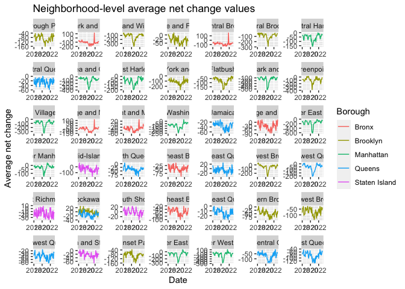

p8105_mtp_yw4200
================
yh
2023-10-19

## Problem 1 – Data import, cleaning, and quality control

``` r
library(readxl)
library(dplyr)
```

    ## 
    ## Attaching package: 'dplyr'

    ## The following objects are masked from 'package:stats':
    ## 
    ##     filter, lag

    ## The following objects are masked from 'package:base':
    ## 
    ##     intersect, setdiff, setequal, union

``` r
# import coa dataset and merge different years' sheet together
coa_data <- data.frame()
excel_file <- "./local_data/USPS CHANGE OF ADDRESS NYC.xlsx"
sheet_names <- excel_sheets("./local_data/USPS CHANGE OF ADDRESS NYC.xlsx")

for (sheet_name in c("2018","2019","2020","2021","2022")) {
  sheet_data <- read_excel("./local_data/USPS CHANGE OF ADDRESS NYC.xlsx", sheet = sheet_name)
  coa_data <- bind_rows(coa_data, sheet_data)
}

#import zip dataset
zip_data <- read.csv("./local_data/Zip Codes.csv")

# clean zip dataset
zip_clean <- zip_data |>
  janitor::clean_names() |>
  rename(borough = county_name,
         zipcode = zip_code) |>
  distinct(zipcode, .keep_all = TRUE) |> 
  mutate(borough = recode(borough, 
                          "New York" = "Manhattan", 
                          "Richmond" = "Staten Island",
                          "Bronx" = "Bronx",
                          "Queens" = "Queens",
                          "Kings" = "Brooklyn")) |>
  arrange(zipcode)

head(zip_clean)
```

    ##     borough state_fips county_code county_fips zipcode  file_date
    ## 1 Manhattan         36          61       36061   10001 07/25/2007
    ## 2 Manhattan         36          61       36061   10002 07/25/2007
    ## 3 Manhattan         36          61       36061   10003 07/25/2007
    ## 4 Manhattan         36          61       36061   10004 07/25/2007
    ## 5 Manhattan         36          61       36061   10005 07/25/2007
    ## 6 Manhattan         36          61       36061   10006 07/25/2007
    ##          neighborhood
    ## 1 Chelsea and Clinton
    ## 2     Lower East Side
    ## 3     Lower East Side
    ## 4     Lower Manhattan
    ## 5     Lower Manhattan
    ## 6     Lower Manhattan

``` r
# remove some unnecessary rows and delete the repeated
zip_necessary <- zip_clean |>
  select(-state_fips, -county_code, -county_fips, -file_date) |>
  distinct(zipcode, .keep_all = TRUE)

head(zip_necessary)
```

    ##     borough zipcode        neighborhood
    ## 1 Manhattan   10001 Chelsea and Clinton
    ## 2 Manhattan   10002     Lower East Side
    ## 3 Manhattan   10003     Lower East Side
    ## 4 Manhattan   10004     Lower Manhattan
    ## 5 Manhattan   10005     Lower Manhattan
    ## 6 Manhattan   10006     Lower Manhattan

``` r
# clean coa dataset
coa_clean <- coa_data |>
  janitor::clean_names() |>
  rename(date = month) |>
  mutate(year = lubridate::year(date),
         month = lubridate::month(date),
         net_change = total_perm_in - total_perm_out
         ) |>
  select(year,everything()) |>
  arrange(zipcode)

head(coa_clean)
```

    ##   year       date zipcode     city total_perm_out total_perm_in month
    ## 1 2018 2018-01-01   10001 NEW YORK            395           403     1
    ## 2 2018 2018-02-01   10001 NEW YORK            356           399     2
    ## 3 2018 2018-03-01   10001 NEW YORK            490           423     3
    ## 4 2018 2018-04-01   10001 NEW YORK            431           424     4
    ## 5 2018 2018-05-01   10001 NEW YORK            528           536     5
    ## 6 2018 2018-06-01   10001 NEW YORK            554           576     6
    ##   net_change
    ## 1          8
    ## 2         43
    ## 3        -67
    ## 4         -7
    ## 5          8
    ## 6         22

``` r
# merge two dataset
merge_data <- left_join(coa_clean, zip_necessary,by = "zipcode")
```

The major steps:

Firstly, to import the sheets from various years into a single dataset,
I used bind_rows and a for loop for the `coa_data`. Second, I renamed
variables `borough` and `zipcode`, deleted rows with repeated zipcodes,
recoded the boroughs’ name by using county names and sorted the
variables according to `zipcode`. Subsequently, it was noted that the
additional data required and the overlap of `zipcode` in the `zip_clean`
would result in a growth of merged dataset. I extracted the years from
the COA dataset using the `lubridate` function, added new variables
using `mutate`, and rearranged the rows and columns using `arrange` and
`select`. In the end, I combined the two datasets using `left_join` to
achieve `merge_data`.

``` r
# ZIP code only in COA dataset
only_COA = nrow(subset(coa_clean, !(zipcode %in% zip_necessary$zipcode)))
only_COA
```

    ## [1] 0

``` r
# ZIP code only in zipcode dataset
only_zip = nrow(subset(zip_necessary, !(zipcode %in% coa_clean$zipcode)))
only_zip
```

    ## [1] 83

``` r
# count variables in merge data
nrow(merge_data)
```

    ## [1] 11845

``` r
length(unique(merge_data$zipcode))
```

    ## [1] 237

``` r
length(unique(merge_data$neighborhood))
```

    ## [1] 43

The resulting dataset:

Only 83 zipcode appear only in zip dataset but not in coa dataset. No
zipcode only appear in coa dataset.11845 total observations exist. 237
unique ZIP codes are included. 43 unique neighborhoods.

``` r
# find most common city in manhattan
manhattan_cities <- merge_data |>
  filter(borough == "Manhattan") |>
  group_by(city) |>
  summarize(count = n()) |>
  arrange(desc(count)) |>
  head(5) 

manhattan_cities |> knitr::kable()
```

| city             | count |
|:-----------------|------:|
| NEW YORK         |  3477 |
| CANAL STREET     |     4 |
| ROOSEVELT ISL    |     4 |
| ROOSEVELT ISLAND |     4 |
| BOWLING GREEN    |     1 |

``` r
# find most common city in queens
queens_cities <- merge_data |>
  filter(borough == "Queens") |>
  group_by(city) |>
  summarize(count = n()) |>
  arrange(desc(count)) |>
  head(5) 

queens_cities |> knitr::kable()
```

| city           | count |
|:---------------|------:|
| JAMAICA        |   372 |
| FLUSHING       |   309 |
| ASTORIA        |   230 |
| QUEENS VILLAGE |   165 |
| BAYSIDE        |   135 |

Comment: In the original `zip_data`, it doesn’t include `borough`
Manhattan. The data possibly lost some boroughs.

``` r
# count observations of each ZIP codes
zipcode_n <- merge_data |>
  group_by(zipcode) |>
  summarize(count = n()) |>
  arrange(count)

zipcode_less60 <- left_join(zipcode_n, zip_necessary, by = "zipcode") |> 
  filter(count < 60)

zipcode_60 <- left_join(zipcode_n, zip_necessary, by = "zipcode") |> 
  filter(count == 60)

neighna_less60 <- zipcode_less60 |> filter(is.na(neighborhood) == TRUE)
neighna_60 <- zipcode_60 |> filter(is.na(neighborhood) == TRUE)

# merge the count number with detailed data and divide them two group
zipcode_missing <- left_join(merge_data,zipcode_n,by = "zipcode") |> 
  arrange(count) |> 
  filter(count < 60)
zipcode_complete <- left_join(merge_data,zipcode_n,by = "zipcode") |> 
  arrange(count) |> 
  filter(count >= 60)

head(zipcode_missing,10)
```

    ##    year       date zipcode          city total_perm_out total_perm_in month
    ## 1  2020 2020-07-01   10121      NEW YORK              0            50     7
    ## 2  2021 2021-10-01   10167      NEW YORK             15             0    10
    ## 3  2020 2020-11-01   10172      NEW YORK            119             0    11
    ## 4  2020 2020-03-01   10173      NEW YORK              0             0     3
    ## 5  2022 2022-10-01   10178      NEW YORK             44             0    10
    ## 6  2020 2020-12-01   10313 STATEN ISLAND              0            12    12
    ## 7  2019 2019-07-01   10138      NEW YORK              0            11     7
    ## 8  2019 2019-10-01   10138      NEW YORK              0            21    10
    ## 9  2021 2021-01-01   10177      NEW YORK             16             0     1
    ## 10 2022 2022-09-01   10177      NEW YORK              0            11     9
    ##    net_change       borough neighborhood count
    ## 1          50     Manhattan         <NA>     1
    ## 2         -15     Manhattan         <NA>     1
    ## 3        -119     Manhattan         <NA>     1
    ## 4           0     Manhattan         <NA>     1
    ## 5         -44     Manhattan         <NA>     1
    ## 6          12 Staten Island         <NA>     1
    ## 7          11     Manhattan         <NA>     2
    ## 8          21     Manhattan         <NA>     2
    ## 9         -16     Manhattan         <NA>     2
    ## 10         11     Manhattan         <NA>     2

``` r
# find those with missing neighborhood in the zipcode missing dataset
missing_neigh1 <- zipcode_missing |> filter(is.na(neighborhood))

# find those with missing neighborhood in the zipcode complete dataset
missing_neigh2 <- zipcode_complete |> filter(is.na(neighborhood))

head(missing_neigh1,5)
```

    ##   year       date zipcode     city total_perm_out total_perm_in month
    ## 1 2020 2020-07-01   10121 NEW YORK              0            50     7
    ## 2 2021 2021-10-01   10167 NEW YORK             15             0    10
    ## 3 2020 2020-11-01   10172 NEW YORK            119             0    11
    ## 4 2020 2020-03-01   10173 NEW YORK              0             0     3
    ## 5 2022 2022-10-01   10178 NEW YORK             44             0    10
    ##   net_change   borough neighborhood count
    ## 1         50 Manhattan         <NA>     1
    ## 2        -15 Manhattan         <NA>     1
    ## 3       -119 Manhattan         <NA>     1
    ## 4          0 Manhattan         <NA>     1
    ## 5        -44 Manhattan         <NA>     1

``` r
head(missing_neigh2,5)
```

    ##   year       date zipcode     city total_perm_out total_perm_in month
    ## 1 2018 2018-01-01   10069 NEW YORK             74            65     1
    ## 2 2018 2018-02-01   10069 NEW YORK             74            76     2
    ## 3 2018 2018-03-01   10069 NEW YORK             59            82     3
    ## 4 2018 2018-04-01   10069 NEW YORK             92            74     4
    ## 5 2018 2018-05-01   10069 NEW YORK             77            93     5
    ##   net_change   borough neighborhood count
    ## 1         -9 Manhattan         <NA>    60
    ## 2          2 Manhattan         <NA>    60
    ## 3         23 Manhattan         <NA>    60
    ## 4        -18 Manhattan         <NA>    60
    ## 5         16 Manhattan         <NA>    60

58 ZIP codes have fewer than 60 observations. Among them, 56 have
missing neighborhood. 179 ZIP codes have complete 60 observations. Among
them, 5 have missing neighborhood. Corresponding to the `merge_data`,
these zip codes are related to 1105 observations. Among those
observations, 988 of them are also missing `neighborhood` values.
Because in the original COA data, some zip codes only have 1-59 months’
observations, which means the time period they recorded was incomplete,
not from 2019 to 2022, such as 10121, 10167, 10172, 10173, 10178. The
reason why there are missing neighborhood is that the neighborhood in
zip data is not complete. The examples are zip codes: 10121, 10167,
10172, 10173, 10178.

## Problem 2 – EDA and Visualization

``` r
library(tidyr)
#  table showing the average of net_change in each borough and year
net_change <- merge_data |> 
  group_by(year,borough) |> 
  summarise(avg_netchange = mean(net_change)) |>
  arrange(borough,year) |>
  mutate(avg_netchange = round(avg_netchange, 2)) |>
  pivot_wider(names_from = year, values_from = avg_netchange)
```

    ## `summarise()` has grouped output by 'year'. You can override using the
    ## `.groups` argument.

``` r
net_change |> knitr::kable()
```

| borough       |   2018 |   2019 |    2020 |   2021 |   2022 |
|:--------------|-------:|-------:|--------:|-------:|-------:|
| Bronx         | -46.30 | -48.02 |  -72.65 | -66.10 | -53.19 |
| Brooklyn      | -46.18 | -51.68 | -110.67 | -76.84 | -55.38 |
| Manhattan     | -41.97 | -52.78 | -126.43 | -38.98 | -46.59 |
| Queens        | -26.64 | -29.29 |  -48.28 | -45.37 | -30.78 |
| Staten Island |  -9.85 |  -9.12 |  -10.54 | -22.55 | -16.30 |

Comment on trends:

The average net change values for all five boroughs between 2018 and
2022 are negative. From 2018 to 2020, the average net change value for
all five cities decreases significantly and trends more sharply. After
2020, the average net change value for all five boroughs improves
considerably but stays negative. 2020 is the year with the lowest
netchange for all five boroughs. Richmond has the highest average net
change value overall among the five boroughs, while New York has the
lowest overall.

``` r
library(tidyr)
#  table showing the five lowest values of net_change
five_lowest <- merge_data |> 
 arrange(net_change) |>
  head(5) |>
  select(zipcode, neighborhood, year, month, net_change)

five_lowest |> knitr::kable()
```

| zipcode | neighborhood                  | year | month | net_change |
|--------:|:------------------------------|-----:|------:|-----------:|
|   10022 | Gramercy Park and Murray Hill | 2020 |     5 |       -983 |
|   10009 | Lower East Side               | 2020 |     7 |       -919 |
|   10016 | Gramercy Park and Murray Hill | 2020 |     6 |       -907 |
|   10016 | Gramercy Park and Murray Hill | 2020 |     7 |       -855 |
|   10009 | Lower East Side               | 2020 |     6 |       -804 |

``` r
#  table showing the five lowest values of net_change
five_highest <- merge_data |> 
  filter(year < 2020) |>
  arrange(desc(net_change)) |>
  head(5) |>
  select(zipcode, neighborhood, year, month, net_change)

five_highest |> knitr::kable()
```

| zipcode | neighborhood        | year | month | net_change |
|--------:|:--------------------|-----:|------:|-----------:|
|   11101 | Northwest Queens    | 2018 |     4 |        360 |
|   11101 | Northwest Queens    | 2018 |     6 |        344 |
|   11101 | Northwest Queens    | 2018 |     5 |        300 |
|   10001 | Chelsea and Clinton | 2018 |     7 |        225 |
|   11201 | Northwest Brooklyn  | 2018 |     4 |        217 |

``` r
library(ggplot2)
# making a plot showing neighborhood-level average net_change values
netchange_data <- merge_data |>
  group_by(neighborhood,date,borough) |>
  summarise(avg_netchange = mean(net_change)) |>
  filter(!is.na(neighborhood))
```

    ## `summarise()` has grouped output by 'neighborhood', 'date'. You can override
    ## using the `.groups` argument.

``` r
netchange_plot <- ggplot(netchange_data,aes(x = date, y = avg_netchange, color = borough)) + 
  geom_line() +
  labs(
    x = "Date",
    y = "Average net change",
    color = "Borough",
    title = "Neighborhood-level average net change values"
  ) + 
  facet_wrap(~neighborhood, scales = "free")

netchange_plot
```

<!-- -->

``` r
ggsave("results/netchange_plot.png", plot = netchange_plot, width = 15, height = 10)
```

Comment:

The seasonal fluctuations in average net change for different
neighborhoods within the same borough exhibit similar varying trends. In
2020, the majority of neighborhoods show a discernible decrease in their
monthly average net change,probably due to the pandemic. Following 2020,
the majority of them exhibit signs of recovery, with monthly average net
changes increasing beginning in 2020.

Limitations:

First, there is still some missing data regarding neighborhoods and
time. Second, it is not possible to calculate the net change change
value as a percentage of the total population (a measure of the relative
size of the change) because we do not know the current ZIP code level
population sizes for each area. Lastly, in order to gather more data,
the time segmentation could be more precise.

``` r
wordcountaddin::text_stats("p8105_mtp_yw4200.Rmd")
```

    ## For information on available language packages for 'koRpus', run
    ## 
    ##   available.koRpus.lang()
    ## 
    ## and see ?install.koRpus.lang()

| Method          | koRpus      | stringi       |
|:----------------|:------------|:--------------|
| Word count      | 495         | 479           |
| Character count | 3119        | 3119          |
| Sentence count  | 39          | Not available |
| Reading time    | 2.5 minutes | 2.4 minutes   |
